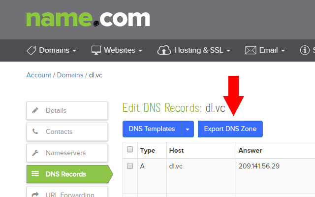

Name.com DNS Export
===================

Name.com DNS Export is a Chrome extension to export DNS entries for domains registered with Name.com. This is useful if you wish to transfer to another DNS provider.

The extension adds a new "Export DNS Zone" button to the Name.com DNS management interface:

Install it through the Chrome Web Store: https://chrome.google.com/webstore/detail/namecom-dns-export/aiicaodgbnkhkpioheplhondjbkaokaa

Changelog
=========
0.1 - 6th March 2017
--------------------
 - Initial release
